EDA - Wpływ muzyki na zdrowie psychiczne
================
Zofia Padoł

- [Wstęp](#wstęp)
  - [Cel analizy](#cel-analizy)
  - [Opis zestawu danych](#opis-zestawu-danych)
  - [Niezbędne biblioteki](#niezbędne-biblioteki)
  - [Zapoznanie z danymi](#zapoznanie-z-danymi)
- [Czyszczenie danych](#czyszczenie-danych)
  - [Poznanie struktury danych, zamiana
    typów](#poznanie-struktury-danych-zamiana-typów)
  - [Sprawdzenie braków danych](#sprawdzenie-braków-danych)
  - [Sprawdzenie wartości
    odstających](#sprawdzenie-wartości-odstających)
- [Analiza zmiennych](#analiza-zmiennych)
  - [Główna platforma streamingowa](#główna-platforma-streamingowa)
  - [Ulubiony gatunek muzyczny](#ulubiony-gatunek-muzyczny)
  - [Wiek](#wiek)
  - [Liczba godzin słuchania muzyki
    dziennie](#liczba-godzin-słuchania-muzyki-dziennie)
  - [Wpływ muzyki na zdrowie
    psychiczne](#wpływ-muzyki-na-zdrowie-psychiczne)
  - [Poziom depresji, lęku,
    bezsenności](#poziom-depresji-lęku-bezsenności)
- [Analiza zależności](#analiza-zależności)
  - [Jakie ciekawe zależności występują między zmiennymi
    ilościowymi?](#jakie-ciekawe-zależności-występują-między-zmiennymi-ilościowymi)
  - [Czy gra na instrumencie faktycznie zależy od wieku? Sprawdzenie
    poprawności wyniku na
    korelogramie](#czy-gra-na-instrumencie-faktycznie-zależy-od-wieku-sprawdzenie-poprawności-wyniku-na-korelogramie)
  - [Czy na gust muzyczny ma wpływ wiek
    badanych?](#czy-na-gust-muzyczny-ma-wpływ-wiek-badanych)
  - [Czy istnieje zależność między poziomem lęku a tempem
    utworu?](#czy-istnieje-zależność-między-poziomem-lęku-a-tempem-utworu)
  - [Jaki wpływ na poziom lęku ma częstotliwość słuchania danego
    gatunku?](#jaki-wpływ-na-poziom-lęku-ma-częstotliwość-słuchania-danego-gatunku)
  - [Czy istnieje zależność pomiędzy poziomem bezsennośći a liczbą
    godzin słuchania
    muzyki?](#czy-istnieje-zależność-pomiędzy-poziomem-bezsennośći-a-liczbą-godzin-słuchania-muzyki)
  - [Jaki wpływ na bezsenność ma liczba uderzeń na minutę w danym
    utworze
    (tempo)?](#jaki-wpływ-na-bezsenność-ma-liczba-uderzeń-na-minutę-w-danym-utworze-tempo)
  - [Muzyka a depresja. Czy chorzy na depresję słuchają muzyki
    częściej?](#muzyka-a-depresja-czy-chorzy-na-depresję-słuchają-muzyki-częściej)
  - [Czy częste słuchanie wybranych gatunków muzycznych koreluje z
    poziomem
    depresji?](#czy-częste-słuchanie-wybranych-gatunków-muzycznych-koreluje-z-poziomem-depresji)
- [Podsumowanie](#podsumowanie)

## Wstęp

### Cel analizy

Muzyka odgrywa istotną rolę w naszym codziennym życiu. Ale czy może ona
oddziaływać na nasze zdrowie emocjonalne i psychiczne, zmieniać jakość
życia, samopoczucie, sen? Czy wpływ ten zależy od rodzaju słuchanej
muzyki lub liczby godzin spędzonych na słuchaniu? W poniższej analizie
sprawdzę wzajemne zależności między wskaźnikami zdrowia psychicznego a
czynnikami związanymi z muzyką, a także wezmę pod lupę inne ciekawe
założenia związane z nawykami muzycznymi respondentów, niekoniecznie
powiązane z chorobami.

### Opis zestawu danych

Analizę wykonam na zestawie danych znalezionym na Kaggle. Zestaw zawiera
podstawowe informacje na temat osoby badanej i jej styczności z muzyką,
oraz poziomu poszczególnej choroby psychicznej.

Zmienne:

**Age** - wiek (liczbowo)  
**Primary.streaming.service** - główna platforma streamingowa (tekst:
Spotify, Pandora, Apple Music, YouTube Music, Other streaming service, I
do not use a streaming service)  
**Hours.per.day** - liczba godzin słuchania muzyki dziennie (liczba
0-24)  
**While.working** - czy słucha muzyki podczas pracy (tekst: Yes,No)  
**Instrumentalist** - czy gra na instrumencie (tekst: Yes,No)  
**Composer** - czy komponuje (tekst: Yes,No)  
**Fav.genre** - ulubiony gatunek (tekst: Classical, Country, EDM, Folk,
Gospel, Hip hop, Jazz, K pop, Latin, Lofi, Metal, Pop, R&B, Rap, Rock,
Video game music)  
**BPM** - tempo (liczbowo)

Częstotliwość słuchania gatunków (tekst: Never, Rarely, Sometimes, Very
frequently) :  
**Frequency..Classical.**  
**Frequency..Country.**  
**Frequency..Hip.hop.**  
**Frequency..Jazz.**  
**Frequency..Metal.**  
**Frequency..Pop.**  
**Frequency..Rap.**  
**Frequency..Rock.**

Zdrowie psychiczne (liczbowo : 1-10):  
**Anxiety** - stany lękowe  
**Depression** - depresja  
**Insomnia** - bezsenność

**Music.effects** - wpływ muzyki na zdrowie psychiczne badanego (tekst:
Improve, Worsen, No effect)

### Niezbędne biblioteki

``` r
library(tidyverse)
library(dplyr)
library(ggplot2)
library(psych)
library(corrplot)
library(nortest)
library(dunn.test)
```

### Zapoznanie z danymi

``` r
head(dane_muzyka)
```

    ##   Age Primary.streaming.service Hours.per.day While.working Instrumentalist
    ## 1  18                   Spotify           3.0           Yes             Yes
    ## 2  63                   Pandora           1.5           Yes              No
    ## 3  18                   Spotify           4.0            No              No
    ## 4  61             YouTube Music           2.5           Yes              No
    ## 5  18                   Spotify           4.0           Yes              No
    ## 6  18                   Spotify           5.0           Yes             Yes
    ##   Composer        Fav.genre BPM Frequency..Classical. Frequency..Country.
    ## 1      Yes            Latin 156                Rarely               Never
    ## 2       No             Rock 119             Sometimes               Never
    ## 3       No Video game music 132                 Never               Never
    ## 4      Yes             Jazz  84             Sometimes               Never
    ## 5       No              R&B 107                 Never               Never
    ## 6      Yes             Jazz  86                Rarely           Sometimes
    ##   Frequency..Hip.hop. Frequency..Jazz. Frequency..Metal. Frequency..Pop.
    ## 1           Sometimes            Never             Never Very frequently
    ## 2              Rarely  Very frequently             Never       Sometimes
    ## 3              Rarely           Rarely         Sometimes          Rarely
    ## 4               Never  Very frequently             Never       Sometimes
    ## 5     Very frequently            Never             Never       Sometimes
    ## 6           Sometimes  Very frequently            Rarely Very frequently
    ##   Frequency..Rap. Frequency..Rock. Anxiety Depression Insomnia Music.effects
    ## 1 Very frequently            Never       3          0        1              
    ## 2          Rarely  Very frequently       7          2        2              
    ## 3          Rarely           Rarely       7          7       10     No effect
    ## 4           Never            Never       9          7        3       Improve
    ## 5 Very frequently            Never       7          2        5       Improve
    ## 6 Very frequently  Very frequently       8          8        7       Improve

``` r
tail(dane_muzyka,3)
```

    ##     Age Primary.streaming.service Hours.per.day While.working Instrumentalist
    ## 734  19   Other streaming service             6           Yes              No
    ## 735  19                   Spotify             5           Yes             Yes
    ## 736  29             YouTube Music             2           Yes              No
    ##     Composer Fav.genre BPM Frequency..Classical. Frequency..Country.
    ## 734      Yes       Rap 120                Rarely           Sometimes
    ## 735       No Classical 170       Very frequently               Never
    ## 736       No   Hip hop  98             Sometimes              Rarely
    ##     Frequency..Hip.hop. Frequency..Jazz. Frequency..Metal. Frequency..Pop.
    ## 734     Very frequently           Rarely            Rarely       Sometimes
    ## 735               Never           Rarely             Never           Never
    ## 736     Very frequently  Very frequently             Never       Sometimes
    ##     Frequency..Rap. Frequency..Rock. Anxiety Depression Insomnia Music.effects
    ## 734       Sometimes           Rarely       2          2        2       Improve
    ## 735           Never            Never       2          3        2       Improve
    ## 736 Very frequently  Very frequently       2          2        2       Improve

## Czyszczenie danych

### Poznanie struktury danych, zamiana typów

``` r
str(dane_muzyka)
```

    ## 'data.frame':    736 obs. of  20 variables:
    ##  $ Age                      : int  18 63 18 61 18 18 18 21 19 18 ...
    ##  $ Primary.streaming.service: chr  "Spotify" "Pandora" "Spotify" "YouTube Music" ...
    ##  $ Hours.per.day            : num  3 1.5 4 2.5 4 5 3 1 6 1 ...
    ##  $ While.working            : chr  "Yes" "Yes" "No" "Yes" ...
    ##  $ Instrumentalist          : chr  "Yes" "No" "No" "No" ...
    ##  $ Composer                 : chr  "Yes" "No" "No" "Yes" ...
    ##  $ Fav.genre                : chr  "Latin" "Rock" "Video game music" "Jazz" ...
    ##  $ BPM                      : int  156 119 132 84 107 86 66 95 94 155 ...
    ##  $ Frequency..Classical.    : chr  "Rarely" "Sometimes" "Never" "Sometimes" ...
    ##  $ Frequency..Country.      : chr  "Never" "Never" "Never" "Never" ...
    ##  $ Frequency..Hip.hop.      : chr  "Sometimes" "Rarely" "Rarely" "Never" ...
    ##  $ Frequency..Jazz.         : chr  "Never" "Very frequently" "Rarely" "Very frequently" ...
    ##  $ Frequency..Metal.        : chr  "Never" "Never" "Sometimes" "Never" ...
    ##  $ Frequency..Pop.          : chr  "Very frequently" "Sometimes" "Rarely" "Sometimes" ...
    ##  $ Frequency..Rap.          : chr  "Very frequently" "Rarely" "Rarely" "Never" ...
    ##  $ Frequency..Rock.         : chr  "Never" "Very frequently" "Rarely" "Never" ...
    ##  $ Anxiety                  : num  3 7 7 9 7 8 4 5 2 2 ...
    ##  $ Depression               : num  0 2 7 7 2 8 8 3 0 2 ...
    ##  $ Insomnia                 : num  1 2 10 3 5 7 6 5 0 5 ...
    ##  $ Music.effects            : chr  "" "" "No effect" "Improve" ...

Aby przygotować dane do analizy zamienię opisy tekstowe na uporządkowane
(faktory) oraz wartości binarne:

``` r
poziomy <- c("Never", "Rarely", "Sometimes", "Very frequently")
factorFreq <-  function(x) {factor(x, levels = poziomy, ordered = TRUE)}
dane_muzyka[,9:16] <- lapply(dane_muzyka[,9:16], factorFreq)

poziomyEfektu <- c("Worsen","No effect","Improve")
dane_muzyka$Music.effects <- factor(dane_muzyka$Music.effects, levels = poziomyEfektu, ordered = TRUE)

dane_muzyka[,c(4,5,6)] <- ifelse(dane_muzyka[,c(4,5,6)] == "Yes", 1, 0)
```

Ponowne wyświetlenie struktury:

``` r
str(dane_muzyka)
```

    ## 'data.frame':    736 obs. of  20 variables:
    ##  $ Age                      : int  18 63 18 61 18 18 18 21 19 18 ...
    ##  $ Primary.streaming.service: chr  "Spotify" "Pandora" "Spotify" "YouTube Music" ...
    ##  $ Hours.per.day            : num  3 1.5 4 2.5 4 5 3 1 6 1 ...
    ##  $ While.working            : num  1 1 0 1 1 1 1 1 1 1 ...
    ##  $ Instrumentalist          : num  1 0 0 0 0 1 1 0 0 0 ...
    ##  $ Composer                 : num  1 0 0 1 0 1 0 0 0 0 ...
    ##  $ Fav.genre                : chr  "Latin" "Rock" "Video game music" "Jazz" ...
    ##  $ BPM                      : int  156 119 132 84 107 86 66 95 94 155 ...
    ##  $ Frequency..Classical.    : Ord.factor w/ 4 levels "Never"<"Rarely"<..: 2 3 1 3 1 2 3 1 1 2 ...
    ##  $ Frequency..Country.      : Ord.factor w/ 4 levels "Never"<"Rarely"<..: 1 1 1 1 1 3 1 1 4 2 ...
    ##  $ Frequency..Hip.hop.      : Ord.factor w/ 4 levels "Never"<"Rarely"<..: 3 2 2 1 4 3 2 4 1 2 ...
    ##  $ Frequency..Jazz.         : Ord.factor w/ 4 levels "Never"<"Rarely"<..: 1 4 2 4 1 4 3 2 1 2 ...
    ##  $ Frequency..Metal.        : Ord.factor w/ 4 levels "Never"<"Rarely"<..: 1 1 3 1 1 2 2 1 4 1 ...
    ##  $ Frequency..Pop.          : Ord.factor w/ 4 levels "Never"<"Rarely"<..: 4 3 2 3 3 4 2 3 1 3 ...
    ##  $ Frequency..Rap.          : Ord.factor w/ 4 levels "Never"<"Rarely"<..: 4 2 2 1 4 4 1 2 1 2 ...
    ##  $ Frequency..Rock.         : Ord.factor w/ 4 levels "Never"<"Rarely"<..: 1 4 2 1 1 4 1 1 4 3 ...
    ##  $ Anxiety                  : num  3 7 7 9 7 8 4 5 2 2 ...
    ##  $ Depression               : num  0 2 7 7 2 8 8 3 0 2 ...
    ##  $ Insomnia                 : num  1 2 10 3 5 7 6 5 0 5 ...
    ##  $ Music.effects            : Ord.factor w/ 3 levels "Worsen"<"No effect"<..: NA NA 2 3 3 3 3 3 3 3 ...

### Sprawdzenie braków danych

``` r
colSums(is.na(dane_muzyka))
```

    ##                       Age Primary.streaming.service             Hours.per.day 
    ##                         1                         0                         0 
    ##             While.working           Instrumentalist                  Composer 
    ##                         0                         0                         0 
    ##                 Fav.genre                       BPM     Frequency..Classical. 
    ##                         0                       107                         0 
    ##       Frequency..Country.       Frequency..Hip.hop.          Frequency..Jazz. 
    ##                         0                         0                         0 
    ##         Frequency..Metal.           Frequency..Pop.           Frequency..Rap. 
    ##                         0                         0                         0 
    ##          Frequency..Rock.                   Anxiety                Depression 
    ##                         0                         0                         0 
    ##                  Insomnia             Music.effects 
    ##                         0                         8

NA występują w kolumnach BPM, Age, Music.effects

### Sprawdzenie wartości odstających

**decribe()** dla kolumn ilościowych

``` r
dane_muzyka %>%
  select(Age, BPM, Hours.per.day) %>%
  describe()
```

    ##               vars   n       mean          sd median trimmed   mad min     max
    ## Age              1 735      25.21       12.05     21   22.73  5.93  10 8.9e+01
    ## BPM              2 629 1589948.34 39872606.18    120  122.13 31.13   0 1.0e+09
    ## Hours.per.day    3 736       3.57        3.03      3    3.06  1.48   0 2.4e+01
    ##                 range  skew kurtosis         se
    ## Age           7.9e+01  2.12     4.62       0.44
    ## BPM           1.0e+09 24.96   622.01 1589824.92
    ## Hours.per.day 2.4e+01  2.52    10.35       0.11

Analiza statystyk dla danych ilościowych wykazała, że w kolumnie BPM
(tempo - uderzenia na minutę) występują ekstremalnie duże wartości,
znacząco przekraczające realnie maksymalne możliwe tempo. Jako, że 300
uderzeń na minutę uznaje się za bardzo duży wynik, a 30 za bardzo mały,
ograniczę się do tych wartości, a pozostałe zamienię na NA

``` r
dane_muzyka$BPM[dane_muzyka$BPM > 300] <- NA
dane_muzyka$BPM[dane_muzyka$BPM < 30] <- NA
```

Ponowne sprawdzenie statystyk i braków:

``` r
dane_muzyka %>%
  select(Age, BPM, Hours.per.day) %>%
  describe()
```

    ##               vars   n   mean    sd median trimmed   mad min max range skew
    ## Age              1 735  25.21 12.05     21   22.73  5.93  10  89    79 2.12
    ## BPM              2 621 123.76 32.03    120  122.40 31.13  40 220   180 0.38
    ## Hours.per.day    3 736   3.57  3.03      3    3.06  1.48   0  24    24 2.52
    ##               kurtosis   se
    ## Age               4.62 0.44
    ## BPM              -0.12 1.29
    ## Hours.per.day    10.35 0.11

``` r
sum(is.na(dane_muzyka$BPM))
```

    ## [1] 115

Po usunięciu outlierów powyższe statystyki wyglądają na prawdopodobne.
Dość intuicyjny jest wynik kurtozy i skośności dla kolumny
Hours.per.day. Wskazuje on na wysoką koncentracje wyników wokół małych
wartości (mediana 3h). Z powyższych statystyk wynika również to, że
osoby badane to głównie ludzie młodzi. Mediana wynosi 21 lat, a kurtoza
i skośność jest wysoka (dodatnia). Zwiększyła się liczba NA w kolumnie
BPM z 107 na 115 to znaczy, że ,,pozbyłam się” ośmiu outlierów.

## Analiza zmiennych

### Główna platforma streamingowa

``` r
dane_muzyka %>%
  filter(dane_muzyka$Primary.streaming.service != "") %>%
  count(Primary.streaming.service) %>%
  ggplot(aes(x=reorder(Primary.streaming.service, n), y = n)) +
  geom_col(col = "black", fill = "lightgray") +
  labs(
    title = "Główna platforma streamingowa",
    x = "Nazwa platformy",
    y = "Liczba obserwacji"
  ) +
  coord_flip() + 
  theme_bw(base_size = 12)
```

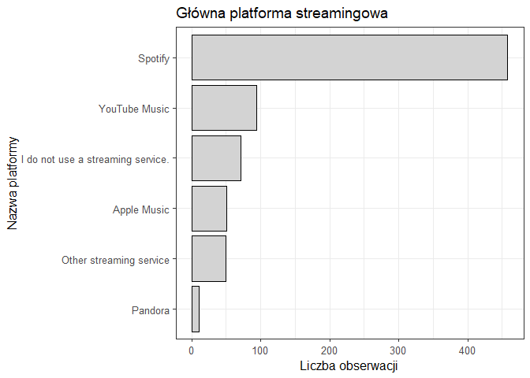<!-- -->

Z wykresu wynika, że główną platformą używaną przez użytkowników jest w
znacznej większości Spotify. Biorąc pod uwagę strukturę wieku
uczestników badania (przewaga ludzi młodych), wynik jest intuicyjny (z
własnych obsrwacji, większość ludzi młodych preferuje Spotify).

### Ulubiony gatunek muzyczny

``` r
dane_muzyka %>%
  count(Fav.genre) %>%
  top_n(8,n) %>%
  ggplot(aes(x = reorder(Fav.genre, n), y = n)) + 
  geom_col(col = "black", fill = "lightgray") +
  labs(
    title = "Ulubiony gatunek muzyczny",
    x = "Nazwa gatunku",
    y = "Liczba obserwacji", 
    caption = "8 gatunków z największą liczbą obserwacji"
  ) +
  coord_flip() + 
  theme_bw(base_size = 12 )
```

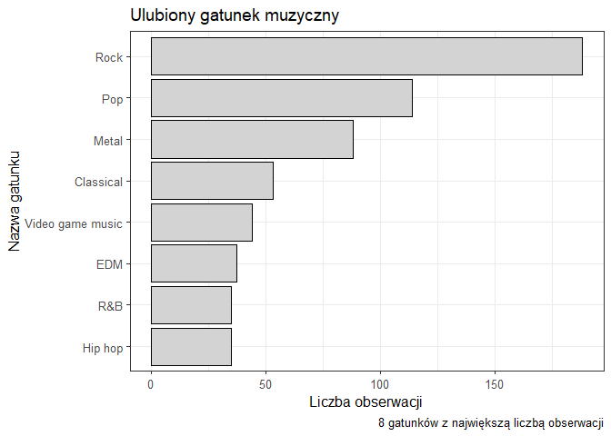<!-- -->

Najczęściej wybieranymi gatunkami muzycznymi wśród respondentów są
kolejno Rock, Pop oraz Metal (gatunki prawdopodobnie popularne wśród
wszystkich grup wiekowych). Na wysokiej pozycji znajduje się muzyka
klasyczna, która prawdopodobnie jest wybierana głównie przez osoby z
najstarszej grupy wiekowej - zweryfikuję to w dalszej analizie.
Zaskakująca jest stosunkowo niska pozycja Hip-hopu, który uplasował się
za takimi gatunkami jak muzyka z gier wideo czy EDM, co może sugerować
specyfikę grupy badanych.

### Wiek

``` r
dane_muzyka %>% 
  ggplot()+
  geom_density(aes(x=Age), fill = "lightgray", col= "black") + 
  labs(title = "Rozkład gęstości wieku",
       x = "Wiek",
       y = "Gęstość") +
  theme_bw(base_size = 12)
```

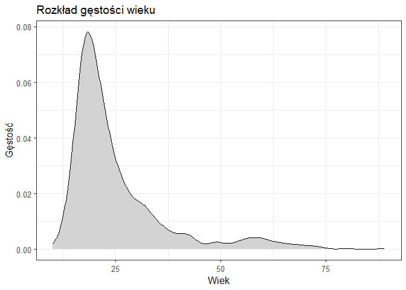<!-- -->

Przeprowadzona analiza struktury wieku potwierdza, że dominującą grupę
stanowią osoby młode. Z rozkładu wynika, że większość respondentów nie
przekroczyło 25 roku życia, badanie objęło głównie nastolatków oraz
młodych dorosłych.

### Liczba godzin słuchania muzyki dziennie

``` r
dane_muzyka %>%
  ggplot() +
  geom_histogram(aes(x = Hours.per.day, ), breaks = seq(0,24,2), fill = "lightgray", col = "black") +
  labs(
    title = "Rozkład liczby godzin słuchania muzyki",
    x = "Liczba godzin/dzień",
    y = "Liczba obserwacji",
    caption = "Jeden słupek reprezentuje 2 godziny"
  ) +
  theme_bw(base_size = 12)
```

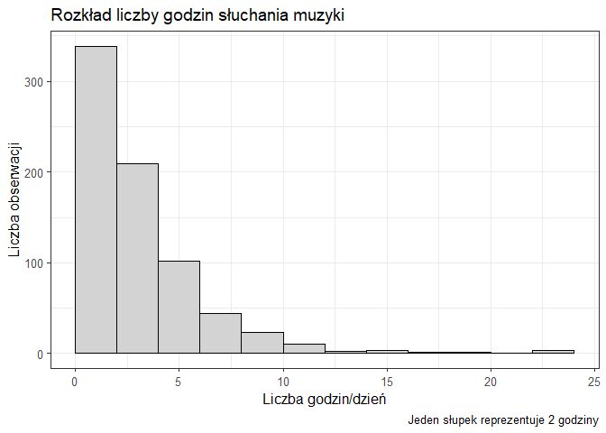<!-- -->

Większość osób słucha muzyki mało/umiarkowanie. Widać natomiast, że
istnieją pojedyncze osoby które słuchają muzyki aż 22-24h. Przyjmując,
że nie są to błędy w raportowaniu, takowy wynik został uzyskany
prawdopodobnie przez to, że dana osoba słucha muzyki “w tle” (np.
podaczas pracy, nauki, snu)

### Wpływ muzyki na zdrowie psychiczne

``` r
dane_muzyka %>%
  filter(!is.na(Music.effects)) %>%
  count(Music.effects) %>%
  ggplot(aes(x = "", y = n, fill = Music.effects )) +
  geom_bar(stat = "identity", width = 1) + 
  coord_polar("y", start = 0) + 
  scale_fill_manual(values = c("#FA8072", "#FFF68F", "#55FF9F"))+
  theme_void(base_size = 12) + 
  labs(
    title = "Wpływ muzyki na zdrowie psychiczne",
    subtitle = "W ocenie badanych",
    fill = "Wpływ",
    caption = "Worsen - negatywny, No effect - brak efektu, Improve - pozytywny"
  )
```

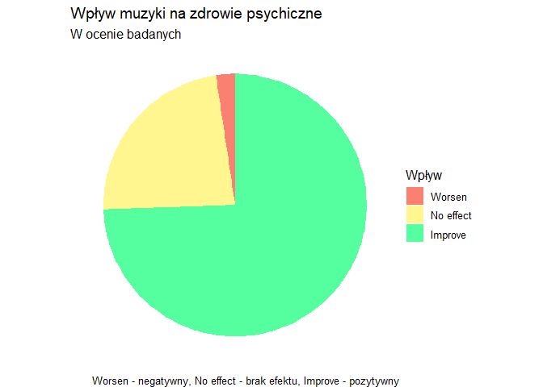<!-- -->

Powyższa wizualizacja przedstawiająca wpływ muzyki na zdrowie psychiczne
badanego (w ocenie badanego), wskazuje na znaczną przewage wyniku
*improve* - poprawa zdrowia. 1/4 odpowiedzi stanowi *No effect* - brak
efektu.

### Poziom depresji, lęku, bezsenności

``` r
dane_muzyka %>%
  ggplot() +
  geom_density(aes(x = Insomnia), col = "#4F94CD", fill = "#5CACEE", alpha = 0.5, size = 1.2) + 
  geom_density(aes(x = Depression), fill = "#E066FF",col = "#B452CD", alpha = 0.5, size = 1.2) +
  geom_density(aes(x = Anxiety), col = "#008B45", fill = "#98FB98", , alpha = 0.3, size=1.2) + 
  theme_bw(base_size = 12) +
  labs(
    title = "Rozkład poziomu chorób", 
    x = "Poziom",
    y = "Gęstość", caption = "zielony - lęk, niebieski - bezsenność, fioletowy - depresja"
  )
```

    ## Warning: Using `size` aesthetic for lines was deprecated in ggplot2 3.4.0.
    ## ℹ Please use `linewidth` instead.
    ## This warning is displayed once every 8 hours.
    ## Call `lifecycle::last_lifecycle_warnings()` to see where this warning was
    ## generated.

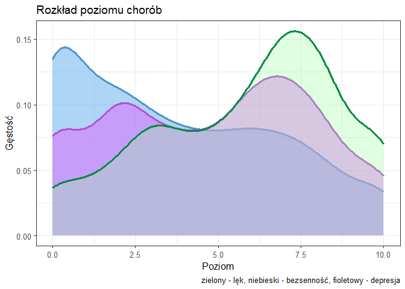<!-- -->

Rozkład chorób jest zróżnicowany:

- Poziom bezsenności stopniowo, gładko maleje - wyniki są równomiernie
  rozłóżone.
- Rozkład poziomu depresji ma 2 delikatne skoki w okolicy wartości 2
  i 7. Przypomina to rozkład dwumodalny (delikatny), może wskazywać na
  występowanie dwóch podgrup które charakteryzują się różnymi wynikami
  depresji. Mimo, że górki nie są bardzo szpiczaste, widać, że duża
  część respondentów albo odczuwa depresje na lekkim poziomie, albo
  odczuwa ją w okoliach poziomu 6.5-7.5. Być może, wynika to z natury
  ludzkich odpowiedzi - gdy osoba chce zaznaczyć niską lecz niezerową
  wartość, a nie jest pewna czy wybrać 1,2 czy może 3, często
  podświadomie wybiera właśnie 2. Tak samo, gdy badany uważa, że jego
  odpowiedź powinna być większa niż 5 ale nie plasuje się w wartości
  ekstremalne, pierwszym strzałem jest wartość 7 - wysoka, lecz nie
  krytyczna. Być może, moje rozważania nie są poprawne lecz stanowią
  pewien dodatek, rzucając światło na psychologiczne podejście do
  procesu udzielania odpowiedzi.
- Wniki dotyczące poziomu lęku skupiają się głównie koło wartości 7.
  Jest to choroba, której wyniki skupione są najbardziej po prawej
  spośród wszystkich chorób. Widać, że dla na ogół ta choroba stanowi
  największy problem dla respondentów.

## Analiza zależności

### Jakie ciekawe zależności występują między zmiennymi ilościowymi?

Istnienie związków między zmiennymi ilościowymi sprawdzę poprzez
wizualizację korelogramu (użyję metody Spearmana jako, że dane nie mają
rozkładów normalnych, niektóre mają charakter porządkowy, mogą
występować w nich outlinery).

``` r
cor1 <- cor(dane_muzyka[,c("Age", "Hours.per.day", "BPM", "Composer", "Instrumentalist", "Anxiety", "Depression", "Insomnia")],use = "complete.obs", method = "spearman")
corrplot(cor1, method = "shade", type = "upper", tl.col = "black", diag = FALSE)
```

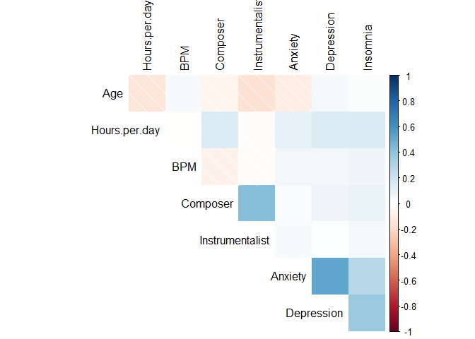<!-- -->

Powyższy korelogram wskazuje na występowanie umiarkowanych, dodatnich
korelacji pomiędzy poszczególnymi wskaźnikami zdrowia psychicznego, co
sugeruje ich częste współwystępowanie. Istotną dodatnią zależność
odnotowano również między zmiennymi Composer a Instrumentalist –
respondenci grający na instrumentach mają skłónności do komponownia.

Wykres ujawnił kilka ujemnych korelacji wieku z pozostałymi zmiennymi:
liczbą godzin słuchania muzyki, grą na instrumencie oraz poziomem lęku.

Spadek odsetka osób grających na instrumentach wraz z wiekiem może
wynikać z faktu, że wiele osób zaprzestaje praktyki muzycznej
rozpoczętej w dzieciństwie (m.in za naciskiem rodziców) po wkroczeniu w
dorosłość.

Niższe wskaźniki lęku u starszych grup wiekowych można interpretować
dwojako. Z jednej strony może to oznaczać naturalne ustępowanie objawów
wraz z wiekiem / uczęszcznie na terapie. Z drugiej strony, wynik ten
może być efektem wzrostu świadomości zdrowotnej – młodsze pokolenia są
częściej badane i lepiej edukowane w zakresie zdrowia psychicznego,
przez co rzadziej bagatelizują swoje problemy w porównaniu do osób
starszych.

Odnotowano również korelację pomiędzy liczbą godzin słuchania muzyki a
wskaźnikami chorób. Może to sugerować, że respondenci sięgają po muzykę
szukając sposobu na poprawe nastroju lub walidacji swoich stanów
emocjonalnych.

### Czy gra na instrumencie faktycznie zależy od wieku? Sprawdzenie poprawności wyniku na korelogramie

Mimo, że na korelogramie została już przedstawiona ta zależność, uważam,
że warto się jej dodatkowo przyjrzeć. Na początku podstawowe statystyki
opisowe:

``` r
dane_muzyka %>%
  group_by(Instrumentalist) %>%
  summarise(
    n = n(),
    min = min(Age, na.rm = TRUE),
    mediana = median(Age, na.rm = TRUE),
    srednia = round(mean(Age, na.rm = TRUE),2),
    max = max(Age, na.rm = TRUE),
    sd = round(sd(Age, na.rm = TRUE),2)
  )
```

    ## # A tibble: 2 × 7
    ##   Instrumentalist     n   min mediana srednia   max    sd
    ##             <dbl> <int> <int>   <dbl>   <dbl> <int> <dbl>
    ## 1               0   501    13      22    26.3    74  12.3
    ## 2               1   235    10      20    23.0    89  11.1

Wstępna analiza wskazuje na potwierdzenie owego założenia - zarówno
średnia jak i mediana są wyższe dla grupy osób nie grających na
instrumencie. Zmienność wyników (odchylenie od średniej) jest również
nieco większa dla osób nie grających. Dodatkowo, wykonam wizualizację,
aby przyjrzeć się rozkładowi wyników dla obu grup:

``` r
dane_muzyka %>%
  ggplot(aes(x = as.factor(Instrumentalist), y = Age, fill = as.factor(Instrumentalist))) +
  geom_boxplot(alpha = 0.5) +
  labs(title = "Rozkład wieku wśród muzyków i nie-muzyków",
       x = "",
       y = "Wiek",
       fill = "Czy gra na instrumencie?
    (0 - nie gra, 1 - gra)") +
  theme_bw(base_size = 12)
```

<!-- -->

Na pierwszy rzut oka, wykres pudełkowy potwierdza lekką, ujemną
zależność (zauważoną wcześniej na korelogramie) między wiekiem a grą na
instrumencie. Mediana wieku dla grupy instrumentalistów jest delikatnie
mniejsza niż dla osób niegrających. Ponadto górna krawędź pudełka
muzyków znajduje się niżej niż górna krawędź nie-muzyków.

Aby sprawdzić, czy wiek grupy osób nie grających na instrumencie jest
istotnie większy od tych grających, wykonam test. Z wykresu wynika, że
rozkład dla tych grup najprawdopodobniej nie jest normalny, ale sprawdzę
to testem Shapiro-Wilk’a aby się upewnic:

``` r
dane_muzyka %>%
  filter(Instrumentalist == 0) %>%
  select(Age) %>%
  pull() %>%
  shapiro.test()
```

    ## 
    ##  Shapiro-Wilk normality test
    ## 
    ## data:  .
    ## W = 0.7741, p-value < 2.2e-16

``` r
dane_muzyka %>%
  filter(Instrumentalist == 1) %>%
  select(Age) %>%
  pull() %>%
  shapiro.test()
```

    ## 
    ##  Shapiro-Wilk normality test
    ## 
    ## data:  .
    ## W = 0.68043, p-value < 2.2e-16

Dane ewidentnie nie mają rozkładu normanego - przeprowadzam test
Wilcoxona dla danych niezależnych

``` r
wilcox.test(Age ~ Instrumentalist, data = dane_muzyka, alternative = "greater")
```

    ## 
    ##  Wilcoxon rank sum test with continuity correction
    ## 
    ## data:  Age by Instrumentalist
    ## W = 71342, p-value = 1.305e-06
    ## alternative hypothesis: true location shift is greater than 0

Wynik p-value jest bardzo niski (1.305e-06) - daje to podstawy do
odrzucenia H0 - potwierdza to, że wiek nie-muzyków jest istotnie większy
niż muzyków.

### Czy na gust muzyczny ma wpływ wiek badanych?

Analiza zostanie przeprowadzona na 8 gatunkach wybieranych najczęściej
za ulubione

``` r
top8 <- dane_muzyka %>%
  count(Fav.genre) %>%
  top_n(8,n)

dane_muzyka %>%
  filter(Fav.genre %in% top8$Fav.genre) %>%
  ggplot(aes(x = Fav.genre, y = Age)) +
  geom_boxplot(fill = "lightgray") +
  theme_bw(base_size = 12) +
  labs(
    title = "Zależność ulubionego gatunku muzycznego od wieku",
    x = "Gatunek",
    y = "Wiek"
  )
```

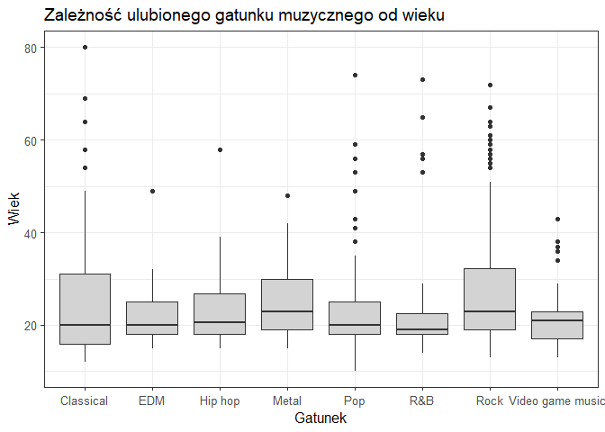<!-- -->

Wstępna wizualizacja danych wskazała na większe zróżnicowanie wieku
wśród osób, których ulubionym gatunkiem jest muzyka klasyczna, rock lub
metal. Mediana dla metalu i rock’a jest nieco wyższa niż dla
pozostałych - sugeruje to wyższy wiek słuchaczy tych gatunków od
pozostałych. Mimo różnicy poziomu median, dolna krawędź pudełek dla
niemal wszystkich gatunków znajduje się na zbliżonym, niskim poziomie.
Świadczy to o tym, że niezależnie od gatunku, muzyka znajduje swoich
odbiorców już wśród najmłodszych grup wiekowych.

Stosunkowo niewielkie różnice w medianach mogą wynikać ze specyfiki
badanego zbioru danych, który składa się w przeważającej mierze z
odpowiedzi osób młodych. Uważam jednak, że z powodu tak małych różnic
median, konieczne będzie dodatkowe sprawdznie. Poniżej wykonam test
sprawdzający, czy obserwowane przez nas różnice w wartościach zmiennej
istotnie zależą od charakterystyki grupy. Na początek sprawdzenie
normalności:

``` r
shapiro.test(dane_muzyka$Age[dane_muzyka$Fav.genre == "Classical"])
```

    ## 
    ##  Shapiro-Wilk normality test
    ## 
    ## data:  dane_muzyka$Age[dane_muzyka$Fav.genre == "Classical"]
    ## W = 0.78186, p-value = 1.881e-07

Widać, że przynajmniej jedna grupa nie ma rozkładu normalnego. Na tym
etapie jasna jest konieczność użycia testu Kruskala-Wallisa

``` r
danetop8 <- dane_muzyka %>% 
  filter(Fav.genre %in% top8$Fav.genre)

kruskal.test(Age ~ Fav.genre, data = danetop8)
```

    ## 
    ##  Kruskal-Wallis rank sum test
    ## 
    ## data:  Age by Fav.genre
    ## Kruskal-Wallis chi-squared = 27.189, df = 7, p-value = 0.0003082

Otrzymany wynik p-value = 0.0003082 pozwala na odrzucenie H0 oraz
wskazuje na istotną różnicę wieku.

``` r
dunn.test(danetop8$Age, danetop8$Fav.genre)
```

    ##   Kruskal-Wallis rank sum test
    ## 
    ## data: x and group
    ## Kruskal-Wallis chi-squared = 27.1885, df = 7, p-value = 0
    ## 
    ## 
    ##                            Comparison of x by group                            
    ##                                 (No adjustment)                                
    ## Col Mean-|
    ## Row Mean |   Classica        EDM    Hip hop      Metal        Pop        R&B
    ## ---------+------------------------------------------------------------------
    ##      EDM |   0.216344
    ##          |     0.4144
    ##          |
    ##  Hip hop |  -0.170723  -0.352993
    ##          |     0.4322     0.3620
    ##          |
    ##    Metal |  -2.005439  -2.016165  -1.541024
    ##          |    0.0225*    0.0219*     0.0617
    ##          |
    ##      Pop |   0.426442   0.129749   0.554789   2.956926
    ##          |     0.3349     0.4484     0.2895    0.0016*
    ##          |
    ##      R&B |   0.334275   0.112214   0.458143   2.109200   0.009884
    ##          |     0.3691     0.4553     0.3234    0.0175*     0.4961
    ##          |
    ##     Rock |  -2.437150  -2.365176  -1.832548  -0.234898  -3.790271  -2.454385
    ##          |    0.0074*    0.0090*     0.0334     0.4071    0.0001*    0.0071*
    ##          |
    ## Video ga |   0.653279   0.389533   0.747781   2.610123   0.351243   0.266802
    ##          |     0.2568     0.3484     0.2273    0.0045*     0.3627     0.3948
    ## Col Mean-|
    ## Row Mean |       Rock
    ## ---------+-----------
    ## Video ga |   3.058840
    ##          |    0.0011*
    ## 
    ## alpha = 0.05
    ## Reject Ho if p <= alpha/2

Wynik powyższego testu wskazuje na istotne różnice dla niektórych par
gatunków np. :

- Słuchacze Rocka i Metalu są statystycznie istotnie starsi od fanów
  Popu, R&B, EDM, muzyki z gier wideo i muzyki klasycznej.
- Różnica między medianą fanów rocka a fanów popu jest najsilniejszą w
  całym zestawieniu (3.79)

Na tym poziomie, mogę obalić tezę, postawioną wcześniej, przy analizie
zmiennych (zmiennej *Fav.genre*), która zakładała to, że najstarsza
grupa wiekowa słucha muzyki klasycznej.

Wynik testu potwierdza poprzednie wnioski postawione na podstawie
wykresu - wiek badanych, których ulubiony gatunek to Rock lub Metal jest
wyższy od badanych o innych preferencjach dotyczących gatunku. Może to
wynikać z tego, że do pewnych gatunków trzeba ,,dojrzeć”. Młodsze osoby
mogą chętniej sięgać po prostsze, powtarzalne, rytmiczne utwory, starsi
natomiast doceniają złożoność utworów metalowych/rockowych. Przyciągać
ich może również bardziej ideologiczny tekst tych utworów.

### Czy istnieje zależność między poziomem lęku a tempem utworu?

Przechodząc już do samej analizy muzyka-choroby, warto zacząć od pewnej
ciekawej właściwości związanej z lękiem. Istnieje założenie, że szybkie
tempo i zbyt głośne dźwięki utworów mogą przyspieszać tętno i wywoływać
stres lub lęk. Poniżej sprawdzę poprawność założenia między tempem a
poziomem lęku:

``` r
dane_muzyka %>%
  ggplot(aes(x = BPM, y = Anxiety)) +
  geom_jitter(alpha = 0.3, color = "#43CD80", size = 3) +
  geom_smooth(method = "lm", color = "#2E8B57") +
  theme_bw() +
  labs(title = "Zależność poziomu lęku od tempa muzyki (BPM)",
       x = "Tempo",
       y = "Poziom lęku")
```

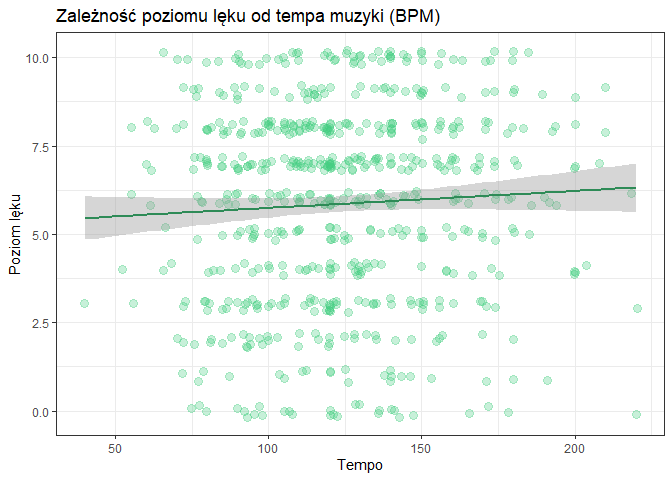<!-- -->

Owa wizualizacja obala powyższą tezę, wskazując na brak wyraźnej
korelacji liniowej. Płaski przebieg linii trendu oraz znaczne
rozproszenie obserwacji sugerują, że tempo utworów samo w sobie nie jest
czynnikiem determinującym stan psychiczny badanych. A może to nie tempo,
a konkretny typ muzyki wpływa na poziom lęku? Poniżej sprawdzę tą
zależność.

### Jaki wpływ na poziom lęku ma częstotliwość słuchania danego gatunku?

Do weryfikacji powyższej zależności wykorzystam dane dotyczące
częstotliwości słuchania poszczególnych gatunków, zamiast tych,
odpowiadających na pytanie, który gatunek jest ulubiony. Przyjęcie
takiej strategii wynika z założenia, że to stopień ekspozycji na dany
rodzaj bodźców dźwiękowych, a nie jedynie subiektywna preferencja, ma
realny wpływ na stan psychiczny respondenta. A fakt, iż dany gatunek
jest uznawany za ulubiony, nie musi bowiem oznaczać, że badany słucha go
najczęściej.

Pod lupę wezmę 2 skrajne odpowiedzi apropo częstotliwości - *Never*
(nigdy), *Very Frequently* (bardzo często)

Na początku dla obu częstotliwości sprawdzę medianę poziomu lęku z
podziałem na gatunek:

``` r
dane_muzyka %>%
  select(Anxiety, starts_with("Frequency")) %>%
  gather("Frequency", "Value", -1) %>%
  filter(Value == "Very frequently") %>%
  mutate(Frequency = substring(Frequency,12)) %>%
  group_by(Frequency) %>%
  summarise(Median = median(Anxiety)) %>%
  arrange(-Median)
```

    ## # A tibble: 8 × 2
    ##   Frequency  Median
    ##   <chr>       <dbl>
    ## 1 Jazz.           7
    ## 2 Pop.            7
    ## 3 Rap.            7
    ## 4 Rock.           7
    ## 5 Classical.      6
    ## 6 Country.        6
    ## 7 Hip.hop.        6
    ## 8 Metal.          6

``` r
dane_muzyka %>%
  select(Anxiety, starts_with("Frequency")) %>%
  gather("Frequency", "Value", -1) %>%
  filter(Value == "Never") %>%
  mutate(Frequency = substring(Frequency,12)) %>%
  group_by(Frequency) %>%
  summarise(Median = median(Anxiety)) %>%
  arrange(-Median)
```

    ## # A tibble: 8 × 2
    ##   Frequency  Median
    ##   <chr>       <dbl>
    ## 1 Classical.      7
    ## 2 Country.        6
    ## 3 Hip.hop.        6
    ## 4 Jazz.           6
    ## 5 Metal.          6
    ## 6 Rap.            6
    ## 7 Rock.           6
    ## 8 Pop.            5

Dodatkowo zwizualizuje rozkład wykresem pudełkowym

``` r
dane_muzyka %>%
  select(Anxiety, starts_with("Frequency")) %>%
  gather("Frequency", "Value", -1) %>%
  filter(Value == "Very frequently") %>%
  mutate(Frequency = substring(Frequency,12)) %>%
  ggplot() + 
  geom_boxplot(aes(x = Frequency, y = Anxiety), col = "#2E8B57", fill = "#43CD80", alpha = 0.5) +
  theme_bw(12) +
  labs(
    title = "Rozkład poziomu lęku u osób słuchających gatunek 'Bardzo często'",
    y = "Poziom lęku",
    x = "Gatunek"
  )
```

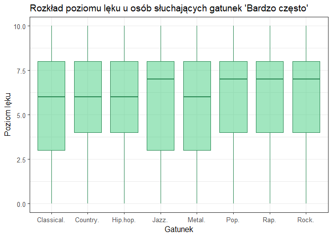<!-- -->

``` r
dane_muzyka %>%
  select(Anxiety, starts_with("Frequency")) %>%
  gather("Frequency", "Value", -1) %>%
  filter(Value == "Never") %>%
  mutate(Frequency = substring(Frequency,12)) %>%
  ggplot(aes(x = Frequency, y = Anxiety)) + 
  geom_boxplot( col = "#2E8B57", fill = "#43CD80", alpha = 0.5) +
  theme_bw(12) +
  labs(
    title = "Rozkład poziomu lęku u osób słuchających gatunek 'Nigdy'",
    y = "Poziom lęku",
    x = "Gatunek"
  )
```

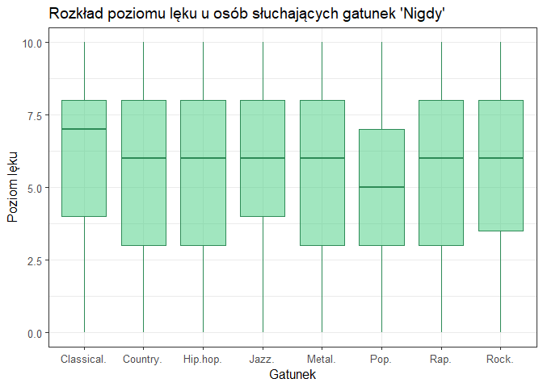<!-- -->

Szczegółowa analiza wykazała lekko zróżnicowane wzorce zależności między
rodzajem słuchanej muzyki a deklarowanym poziomem lęku:

- Muzyka klasyczna : Widać pozytywny wpływ częstej ekspozycji na ten
  gatunek. Całkowita rezygnacja ze słuchania klasyki wiąże się ze
  wzrostem mediany lęku do poziomu 7 (najwyższego w zestawieniu),
  podczas gdy u osób słuchających jej „bardzo często” wynosi ona 6. Poza
  tym, na drugim wykresie widać wyraźne przesunięcie całego „pudełka” w
  górę w porównaniu z grupą słuchającą najczęściej. Może to sugerować
  relaksacyjny i kojący wpływ muzyki klasycznej na zdrowie emocjonalne
  respondentów.

- Muzyka Pop: Zaobserwowano, nieintuicyjną zależność. Mimo powszechnego
  postrzegania muzyki pop jako radosnej i rytmicznej, jej wysoka
  częstotliwość słuchania wiąże się z najwyższą (ex aequo) medianą
  poziomu lęku wynoszącą 7.U osób deklarujących brak kontaktu z popem,
  całe “pudełko” oraz mediana lęku znajdują się na najniższym poziomie
  (wartość 5) spośród wszystkich badanych gatunków. Może to sugerować,
  że nadmierna ekspozycja na proste, powtarzalne dźwięki nie zawsze
  sprzyja wyciszeniu emocjonalnemu.

### Czy istnieje zależność pomiędzy poziomem bezsennośći a liczbą godzin słuchania muzyki?

Kolejnym zagadnieniem, któremu się przyjrzę, jest bezsenność.
Zastanawiające jest to, czy na czas słuchania muzyki wpływa w jakimś
stopniu poziom bezsenności (lub na odwrót). Można założyć, że osoby
cierpiące na bezsenność słuchają muzyki w nocy, gdy nie mogą zasnąć. Z
drugiej strony, słuchanie głośnej i szybkiej muzyki do późna może
pobudzać organizm, sprawiając problemy ze snem. Poniżej sprawdzę
prawdziwość tej zależności

``` r
dane_muzyka %>%
  ggplot(aes(x = Hours.per.day, y = Insomnia)) +
  geom_jitter(alpha = 0.4, color = "#5CACEE", size = 3) +
  geom_smooth(method = "lm", col = "#27408B") +
  theme_bw(base_size = 12) +
  labs(title = "Zależność między czasem słuchania muzyki, a bezsennością",
       x = "Godziny słuchania dziennie",
       y = "Poziom bezsenności ")
```

    ## `geom_smooth()` using formula = 'y ~ x'

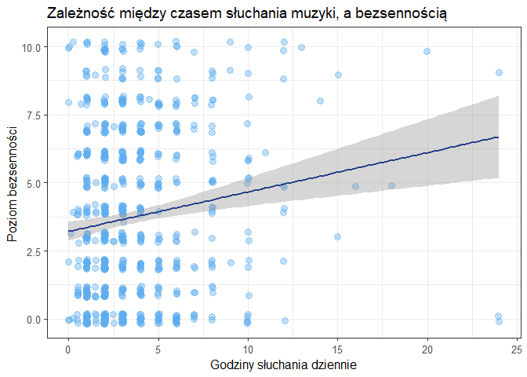<!-- -->

Zastosowna linia regresji wizualizuje ogólny kierunek zależności
wskazując na delikatną dodatnią zależność. Aby sprawdzić czy wykres
poprawnie wskazuje zależność, wykonam dodatkowo test korelacji
Spearmana:

``` r
test <- cor.test(dane_muzyka$Hours.per.day,dane_muzyka$Insomnia, method = "spearman", exact = FALSE)
test$p.value
```

    ## [1] 5.527945e-05

``` r
test$estimate
```

    ##       rho 
    ## 0.1480572

Analiza wykazała słabą (r = 0.15), lecz istotną (p \< 0.001)
statystycznie dodatnią korelację między liczbą godzin słuchania muzyki a
poziomem bezsenności, potwierdza to wnioski wyciągnięte z wizualizacji.

W kontekście wpływu bezsenności na liczbę godzin słuchania (muzyka jako
sposób radzenia sobie z problemami z zasypianiem): dane sugerują, że
tylko niewielka grupa osób intensywnie wykorzystuje muzykę w ten sposób.

W kontekście wpływu muzyki na jakość snu: ryzyko pogorszenia wypoczynku
z powodu nadmiernego słuchania muzyki istnieje, jednak ze względu na
niską wartość korelacji, zjawisko to nie jest powszechne w badanej
grupie

### Jaki wpływ na bezsenność ma liczba uderzeń na minutę w danym utworze (tempo)?

W moim odczuciu zastanawiające jest to, czy tempo słuchanej muzyki może
wpłynąć na poziom bezsenności. Jak wiadomo takie tempo może pobudzać,
zwiększać tętno, a co za tym idzie, może pogorszyć zasypianie. Istnienie
zależności zweryfikuję wykresem:

``` r
dane_muzyka %>%
  ggplot(aes(x = BPM, y = Insomnia)) +
  geom_jitter(alpha = 0.4, color = "#5CACEE", size = 3) +
  geom_smooth(method = "lm", color = "#27408B") +
  theme_bw(base_size = 12) +
  labs(title = "Zależność poziomu bezsenności od tempa muzyki (BPM)",
       x = "Tempo",
       y = "Poziom bezsenności")
```

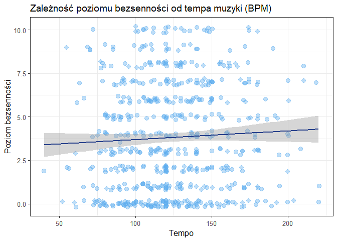<!-- -->

Punkty na wykresie są rozproszone a krzywa regresji jest praktycznie
płaska - taka zależność prawdopodobnie nie istnieje. Oznacza to, że
tempo muzyki nie wpływa na poziom bezsenności - tak samo jak nie
wpływało na poziom lęku. Wniosek z tego może być następujący - choć rytm
utworu może chwilowo wpływać na nastrój, poziom pobudzenia, stres, nie
jest on czynnikiem wpływającym trwale na zaburzenia snu. W badanej
grupie osoby mające trudności z zasypianiem doświadczają ich niezależnie
od tego, czy słuchają muzyki wolnej, czy szybkiej.

### Muzyka a depresja. Czy chorzy na depresję słuchają muzyki częściej?

Ostatnią chorobą, którą przeanalizuję jest depresja. Stereotypowo osoba
z depresją kojarzy się wielu ludziom jako ktoś cichy, z słuchawkami w
uszach, spędzający wiele czasu w osamotnieniu. Sugerowałoby to, że
poziom depresji silnie koreluje z liczbą godzin słuchania muzyki
dziennie. Warto zbadać poprawność tej zależności.

``` r
sum(dane_muzyka$Music.effects == "Worsen", na.rm = TRUE)
```

    ## [1] 17

Ciekawe byłoby porównanie wyników 2 grup - osób, którzy uważają, że
muzyka wpływa na nich pozytywnie oraz tych, na któych w ich opinii
wpływa negatywnie. Niestety liczba respondentów, którzy odpowiedzieli
*Worsen* wynosi tylko 17, więc analiza wykonana na tej grupie byłaby
niewiarygodna. Sprawdzę więc, tylko grupę badanych, którzy zaznaczyli
*Improve*.

``` r
dane_improve <- dane_muzyka%>%
  filter(Music.effects == "Improve")

dane_improve %>%
  ggplot(aes(x = Hours.per.day, y = Depression)) + 
  geom_jitter(alpha = 0.2, col = "mediumpurple", size = 3) + 
  geom_smooth(method = "lm", col = "purple4") +
  theme_bw(base_size = 12) +
  labs(
    title = "Zależność między poziomem depresji a czasem słuchania muzyki",
    x = "Liczba godzin",
    y = "Poziom depresji"
  )
```

    ## `geom_smooth()` using formula = 'y ~ x'

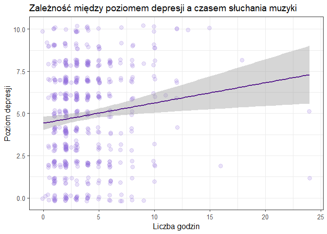<!-- -->

Wizualizacja sugeruje lekki trend wzrostowy, jednak aby upewnić się, że
nie jest on dziełem przypadku, przeprowadziłam test korelacji rangowej
Spearmana.

``` r
test <- cor.test(dane_improve$Hours.per.day,dane_improve$Depression, method = "spearman", exact = FALSE)
round(test$p.value,4)
```

    ## [1] 0.0011

``` r
round(test$estimate,2)
```

    ##  rho 
    ## 0.14

Wynik 0.14 przy p-value 0.0011 wskazuje na lekką, choć istotną
statystycznie, dodatnią korelację - stanowi potwierdzenie obserwacji z
wykresu. Oznacza to, że stereotyp po części jest prawdziwy - osoby z
większym poziomem depresji słuchają muzyki nieco więcej. Jako, że
analizowaną grupą byli respondenci, których zdaniem muzyka wpływa
pozytywnie na ich zdrowie psychiczne, można wywnioskować, że ta
delikatna zależność jest związana z wykorzystywaniem przez te osoby
muzyki do tzw. muzykoterapii - jako narzędzie do regulacji emocji i
ucieczkę od trudnych myśli.

### Czy częste słuchanie wybranych gatunków muzycznych koreluje z poziomem depresji?

Kontynuując sprawdzanie stereotypów, skupię się teraz na zależności
między poziomem depresji a częstotliwością słuchania rocka i metalu.
Osoby zmagające się z depresją są bowiem często kojarzone z takimi
gatunkami.

``` r
dane_muzyka %>%
  ggplot(aes( x = Depression, y = Frequency..Rock.)) + 
  geom_boxplot( fill = "mediumpurple", alpha = 0.4, col = "#9370DB") + 
  theme_bw(base_size = 11) +
  labs(
    title = "Zależność między poziomem depresji a częstotliwością słuchania Rocka",
    x = "Poziom depresji",
    y = "Częstotliwość"
  )
```

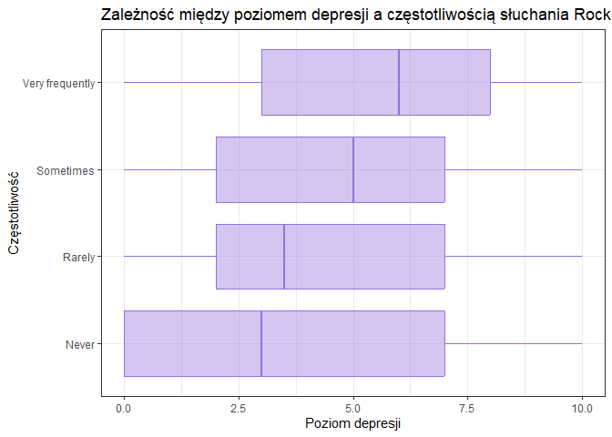<!-- -->

Aby sprawdzić, czy obserwowane różnice median są istotne statystycznie,
przeprowadzę testy. Zaczynam od sprawdzenia normalności rozkładu:

``` r
shapiro.test(dane_muzyka$Depression[dane_muzyka$Frequency..Rock. == "Very frequently"])
```

    ## 
    ##  Shapiro-Wilk normality test
    ## 
    ## data:  dane_muzyka$Depression[dane_muzyka$Frequency..Rock. == "Very frequently"]
    ## W = 0.94253, p-value = 5.084e-10

Wynik testu Shapiro-Wilka dla tej jednej grupy wskazuje na brak
normalności jej rozkładu, co determinuje wybór nieparametrycznego testu
Kruskala-Wallisa.

``` r
kruskal.test(Depression ~ Frequency..Rock., data = dane_muzyka)
```

    ## 
    ##  Kruskal-Wallis rank sum test
    ## 
    ## data:  Depression by Frequency..Rock.
    ## Kruskal-Wallis chi-squared = 26.544, df = 3, p-value = 7.338e-06

``` r
dunn.test(dane_muzyka$Depression, dane_muzyka$Frequency..Rock.)
```

    ##   Kruskal-Wallis rank sum test
    ## 
    ## data: x and group
    ## Kruskal-Wallis chi-squared = 26.5437, df = 3, p-value = 0
    ## 
    ## 
    ##                            Comparison of x by group                            
    ##                                 (No adjustment)                                
    ## Col Mean-|
    ## Row Mean |      Never     Rarely   Sometime
    ## ---------+---------------------------------
    ##   Rarely |  -0.706353
    ##          |     0.2400
    ##          |
    ## Sometime |  -2.874778  -2.084886
    ##          |    0.0020*    0.0185*
    ##          |
    ## Very fre |  -4.392600  -3.593909  -1.853576
    ##          |    0.0000*    0.0002*     0.0319
    ## 
    ## alpha = 0.05
    ## Reject Ho if p <= alpha/2

Wynik p-value testu Kruskal’a jednoznacznie daje podstawy do odrzucenia
H0. Częstotliwość istotnie wpływa na poziom depresji.

Test Dunna wskazuje istotne różnice między niemal wszystkimi
częstotliwościami (największa różnica median występuje oczywiście dla
częstotliwości *Never* - *Very Frequently* i wynosi 4.39)

``` r
dane_muzyka %>%
  ggplot(aes( x = Depression, y = Frequency..Metal.)) + 
  geom_boxplot( fill = "mediumpurple", alpha = 0.4, col = "#9370DB") + 
  theme_bw(base_size = 11) +
  labs(
    title = "Zależność między poziomem depresji częstotliwością słuchania Metalu",
    x = "Poziom depresji",
    y = "Częstotliwość"
  )
```

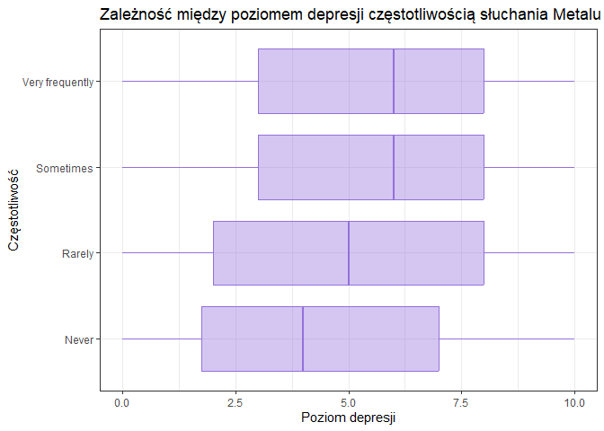<!-- -->

Istotność różnic median powyższego wykresu sprawdzę analogicznie:

``` r
shapiro.test(dane_muzyka$Depression[dane_muzyka$Frequency..Metal. == "Very frequently"])
```

    ## 
    ##  Shapiro-Wilk normality test
    ## 
    ## data:  dane_muzyka$Depression[dane_muzyka$Frequency..Metal. == "Very frequently"]
    ## W = 0.94231, p-value = 1.031e-05

Brak normalności - test Kruskal’a i Dunn’a

``` r
kruskal.test(Depression ~ Frequency..Metal., data = dane_muzyka)
```

    ## 
    ##  Kruskal-Wallis rank sum test
    ## 
    ## data:  Depression by Frequency..Metal.
    ## Kruskal-Wallis chi-squared = 34.052, df = 3, p-value = 1.932e-07

``` r
dunn.test(dane_muzyka$Depression, dane_muzyka$Frequency..Metal.)
```

    ##   Kruskal-Wallis rank sum test
    ## 
    ## data: x and group
    ## Kruskal-Wallis chi-squared = 34.0521, df = 3, p-value = 0
    ## 
    ## 
    ##                            Comparison of x by group                            
    ##                                 (No adjustment)                                
    ## Col Mean-|
    ## Row Mean |      Never     Rarely   Sometime
    ## ---------+---------------------------------
    ##   Rarely |  -4.095469
    ##          |    0.0000*
    ##          |
    ## Sometime |  -5.002724  -1.263118
    ##          |    0.0000*     0.1033
    ##          |
    ## Very fre |  -4.028245  -0.245990   0.962714
    ##          |    0.0000*     0.4028     0.1678
    ## 
    ## alpha = 0.05
    ## Reject Ho if p <= alpha/2

Test Dunna wykonany dla Metalu również wyskazał kilka istotnych różnic -
pomiędzy *Never* a pozostałymi częstotliwościami

Powyższe wizualizacje oraz testy statystyczne sugerują wzrost poziomu
depresji wraz ze wzrostem częstotliwości słuchania zarówno metalu jak i
rock’a. Potwierdza to założenia stereotypu. Warto jednak pamiętać, że
wybór takich gatunków przez osoby z depresją prawdopodobnie nie jest
przyczyną choroby, lecz jego skutkiem (np. sposób ekspresji emocji)

## Podsumowanie

- Słuchacze rocka i metalu są statystycznie starsi od fanów popu/ EDM,
  co może sugerować, że preferencje wobec bardziej złożonych,
  skomlikowanych brzmień pogłębiają się wraz z wiekiem.

- Tempo muzyki (BPM) nie ma związku z poziomem lęku ani bezsenności -
  obala to mit o wpływie szybkości utworu na te zaburzenia.

- Częste słuchanie popu wiąże się z wyższym poziomem lęku, podczas gdy
  osoby całkowicie unikające tego gatunku deklarują najniższe problemy z
  lękiem.

- Intensywne słuchanie rocka oraz metalu wiąże się z wyższym poziomem
  depresji, co prawdopodobnie wynika z traktowania tych rodzajów muzyki
  jako narzędzi do radzenia sobie z trudnymi emocjami.

- Słaba, ale istotna dodatnia korelacja sugeruje, że osoby z większymi
  zaburzeniami snu spędzają nieco więcej godzin z muzyką. Podobna
  korelacja istnieje również między liczbą godzin a poziomem depresji.

*! Niskie korealcje wystpujące między poziomami chorób, a czynnikami
związanymi z muzyką są typowe dla badań związanych ze zdrowiem
psychicznym - taka korelacja wskazuje na wieloczynnikowość tego
zjawiska*
